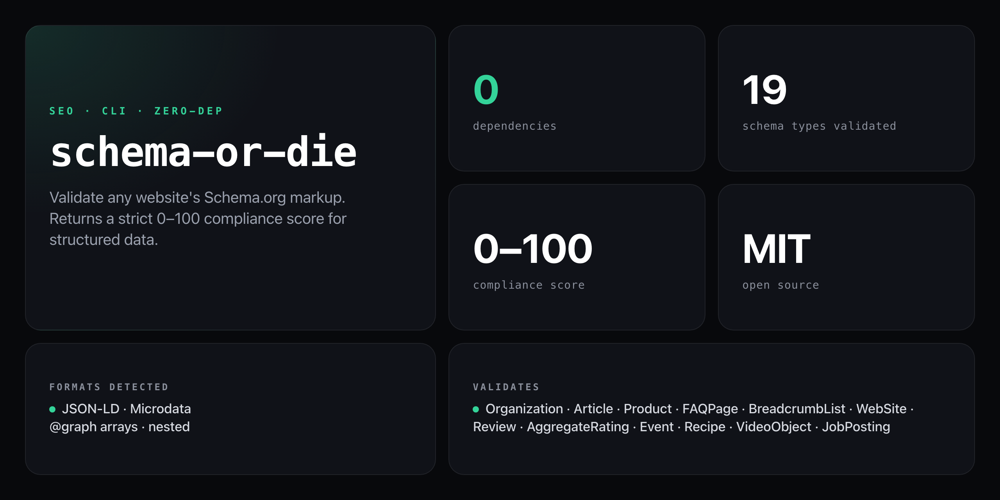

<div align="center">

**Validate any website's structured data and score it 0–100. Because missing schema means missing rich snippets.**


</div>

---

Your competitors are showing up in Google's rich snippets — star ratings, FAQs, breadcrumbs, product prices. You're not. `schema-or-die` fetches any URL, extracts every JSON-LD and Microdata block, validates required fields per schema type, and returns a strict 0–100 compliance score with a field-level breakdown telling you exactly what's missing.

```
SCHEMA OR DIE — Schema.org Validator
━━━━━━━━━━━━━━━━━━━━━━━━━━━━━━━━━━━━━━━━━━

URL: https://example.com

Score: ████████████░░░░░░░░ 58/100

Found schemas:
  ✅ Organization (valid)
  ✅ WebSite (valid)
  ⚠️  Article (missing: datePublished, missing: author)

Missing (recommended):
  ❌ BreadcrumbList
  ❌ FAQPage
  ❌ Product

What Google sees:
  Name: "Example Corp"
  Type: "Organization"
  URL: "https://example.com"

Score breakdown:
  +20  Has schema markup
  +15  Organization
  +10  WebSite
  +10  WebSite has SearchAction
  +0   Article (errors reduced score)

Verdict: "Mediocre. Google squints at your site."

━━━━━━━━━━━━━━━━━━━━━━━━━━━━━━━━━━━━━━━━━━
```

## Install

No install required — runs straight from GitHub with zero dependencies:

```bash
npx github:NickCirv/schema-or-die https://example.com
```

Or install globally:

```bash
npm install -g github:NickCirv/schema-or-die
schema-or-die https://example.com
```

## Usage

```bash
# validate any URL
npx github:NickCirv/schema-or-die https://example.com

# shorthand (https:// added automatically)
npx github:NickCirv/schema-or-die example.com

# show help
npx github:NickCirv/schema-or-die --help
```

| Argument | Description |
|----------|-------------|
| `<url>` | The URL to validate (required). `https://` prepended if omitted. |
| `--help` / `-h` | Show usage and exit |

## Score table

| Score | Verdict |
|-------|---------|
| 0–20 | "Your site is invisible to machines. RIP." |
| 21–40 | "Schema exists but it's on life support." |
| 41–60 | "Mediocre. Google squints at your site." |
| 61–80 | "Solid. Rich snippets are possible." |
| 81–100 | "Chef's kiss. Schema perfection." |

## Scoring breakdown

| Schema type | Base points | Notes |
|-------------|------------|-------|
| Has ANY schema | +20 | base for non-empty pages |
| Organization / LocalBusiness | +15 | |
| WebSite | +10 | +5 bonus if SearchAction present |
| BreadcrumbList | +10 | |
| Article / BlogPosting / NewsArticle | +10 | |
| Product | +15 | |
| FAQPage / HowTo | +10 | |
| Review / AggregateRating | +10 | |
| Event / Recipe / VideoObject / JobPosting / Course | +8 | |
| Missing required field | −10 per field | caps type contribution at 0 |

## What it validates

**Formats detected:**

- JSON-LD (`<script type="application/ld+json">`)
- Microdata (`itemscope` / `itemtype` attributes)
- `@graph` arrays and nested schema objects

**19 schema types with required-field checking:**

| Type | Required fields checked |
|------|------------------------|
| Organization | name, url |
| LocalBusiness | name, address, telephone |
| WebSite | name, url |
| Article / BlogPosting / NewsArticle | headline, datePublished, author |
| Product | name, description |
| FAQPage | mainEntity |
| HowTo | name, step |
| BreadcrumbList | itemListElement |
| Review | itemReviewed, author, reviewRating |
| AggregateRating | ratingValue, reviewCount |
| Event | name, startDate, location |
| Recipe | name, recipeIngredient, recipeInstructions |
| VideoObject | name, description, uploadDate |
| Person | name |
| JobPosting | title, hiringOrganization, jobLocation |
| Course | name, description |
| SoftwareApplication | name, operatingSystem |

## What it is NOT

- **Not a live Google preview.** It reports what schema markup is present and structurally valid — not whether Google has indexed it or chosen to render a rich result.
- **Not a full Schema.org spec enforcer.** Required-field checks cover the most common types; custom or uncommon properties are reported under "Custom/Other types" without scoring.
- **Not a replacement for Google's Rich Results Test.** Use this for fast automated auditing across many URLs; use Google's tool to confirm individual pages before launch.

---

## You might also like

**[Cirv Box](https://wordpress.org/plugins/cirv-box/)** — Schema.org made easy for WordPress. Add structured data to your site without touching code.

---

<div align="center">
<sub>Zero dependencies · Node 14+ · MIT · by <a href="https://github.com/NickCirv">NickCirv</a></sub>
</div>
